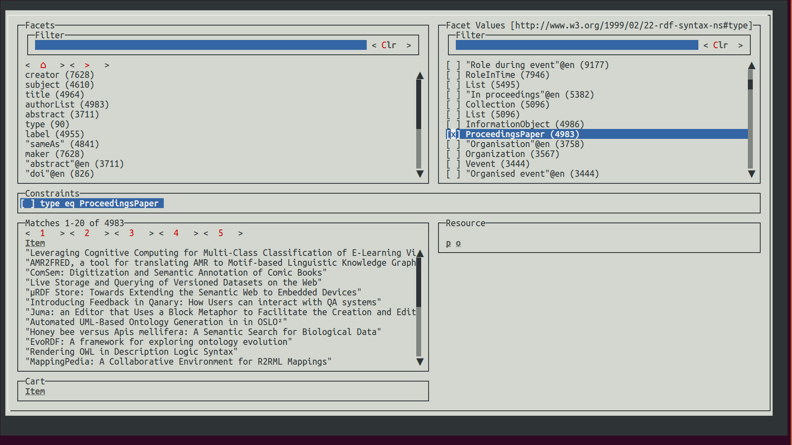

# Facete3 Faceted Search Framework

Facete is a faceted search framework for SPARQL-accessible data. We are working on aggregeations, so actually its becoming more of a SPARQL-based business intelligence system.

A brief history
* Facete 1 was probably the first pure production JavaScript SPARQL-based faceted search system deployed at the European Open Dataportal at around 2012
* Facete 2 was an re-implementation based on Angular 1 (JavaScript) at around 2015
* Facete 3 is the current iteration which finally got large parts of the API just right - this time its Java.

## Factete 3 Components

The project comprises the following component:

* [The core API](facete3-core-parent)
* [A terminal application](facete3-core-parent) (currently part of core, may be moved to a separate module)
* A faceted search benchmark generator. Benchmark results are published in [this repository](https://github.com/hobbit-project/facete3-fsbg-results)!




Here a teaser for what the Facete3 core API looks like - based on RxJava2:

```java
class TestFacetedQuery {
	@Test
	public void testComplexQuery() {
        RDFConnection conn = RDFConnectionFactory.connect(someDataset);
        FacetedQuery fq = fq = FacetedQueryImpl.create(conn);

		FacetValueCount fc =
				// -- Faceted Browsing API
				fq.root()
				.fwd(RDF.type).one()
					.constraints()
						.eq(OWL.Class).activate()
					.end()
				.parent()
				.fwd()
				.facetValueCounts()	
				// --- DataQuery API
				//.sample()
				.randomOrder()
				.limit(1)
				.exec()
				// --- RxJava API
				.firstElement()
				.timeout(10, TimeUnit.SECONDS)
				.blockingGet();

		System.out.println("FacetValueCount: " + fc);
	}
}
```


